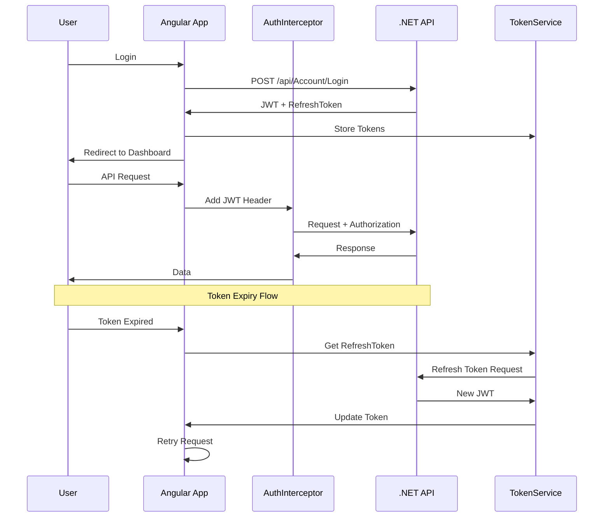

# Angular Frontend Architecture - MyShop E-Commerce

## 1. Project Overview

This Angular frontend will serve as the presentation layer for the MyShop .NET Backend, providing a responsive and interactive user interface for the e-commerce application.

## 2. Technology Stack

| Category | Technology |
|----------|------------|
| Framework | Angular 18+ |
| Language | TypeScript 5.x |
| Styling | SCSS / TailwindCSS |
| HTTP Client | Angular HttpClient |
| State Management | RxJS / Signals |
| Authentication | JWT with Interceptors |
| Routing | Angular Router |
| Forms | Reactive Forms |
| Validation | Angular Validators |

## 3. Folder Structure

```
Identity.Angular/
├── src/
│   ├── app/
│   │   ├── core/                          # Singletons & Infrastructure
│   │   │   ├── interceptors/
│   │   │   │   ├── auth.interceptor.ts   # JWT token injection
│   │   │   │   └── error.interceptor.ts   # Global error handling
│   │   │   ├── guards/
│   │   │   │   ├── auth.guard.ts          # Protected route access
│   │   │   │   └── admin.guard.ts         # Admin route access
│   │   │   ├── services/
│   │   │   │   ├── auth.service.ts
│   │   │   │   ├── token.service.ts
│   │   │   │   ├── product.service.ts
│   │   │   │   ├── category.service.ts
│   │   │   │   └── cart.service.ts
│   │   │   └── models/
│   │   │       ├── user.model.ts
│   │   │       ├── product.model.ts
│   │   │       ├── category.model.ts
│   │   │       └── auth.model.ts
│   │   ├── shared/                        # Reusable Components
│   │   │   ├── components/
│   │   │   │   ├── header/
│   │   │   │   ├── footer/
│   │   │   │   ├── navbar/
│   │   │   │   ├── sidebar/
│   │   │   │   ├── card/
│   │   │   │   ├── modal/
│   │   │   │   └── loading-spinner/
│   │   │   ├── pipes/
│   │   │   │   ├── currency-format.pipe.ts
│   │   │   │   └── date-format.pipe.ts
│   │   │   └── directives/
│   │   │       ├── permission.directive.ts
│   │   │       └── autofocus.directive.ts
│   │   ├── features/                      # Business Feature Modules
│   │   │   ├── auth/
│   │   │   │   ├── components/
│   │   │   │   │   ├── login/
│   │   │   │   │   ├── register/
│   │   │   │   │   ├── forgot-password/
│   │   │   │   │   └── profile/
│   │   │   │   ├── auth.routes.ts
│   │   │   │   └── auth.component.ts
│   │   │   ├── products/
│   │   │   │   ├── components/
│   │   │   │   │   ├── product-list/
│   │   │   │   │   ├── product-detail/
│   │   │   │   │   ├── product-card/
│   │   │   │   │   └── product-form/
│   │   │   │   ├── products.routes.ts
│   │   │   │   └── products.component.ts
│   │   │   ├── categories/
│   │   │   │   ├── components/
│   │   │   │   │   ├── category-list/
│   │   │   │   │   └── category-tree/
│   │   │   │   ├── categories.routes.ts
│   │   │   │   └── categories.component.ts
│   │   │   ├── cart/
│   │   │   │   ├── components/
│   │   │   │   │   ├── cart-list/
│   │   │   │   │   └── cart-item/
│   │   │   │   ├── cart.routes.ts
│   │   │   │   └── cart.component.ts
│   │   │   ├── dashboard/
│   │   │   │   ├── components/
│   │   │   │   │   ├── stats-card/
│   │   │   │   │   ├── recent-orders/
│   │   │   │   │   └── chart-widget/
│   │   │   │   ├── dashboard.routes.ts
│   │   │   │   └── dashboard.component.ts
│   │   │   └── home/
│   │   │       ├── components/
│   │   │       │   ├── hero/
│   │   │       │   ├── featured-products/
│   │   │       │   └── testimonials/
│   │   │       ├── home.routes.ts
│   │   │       └── home.component.ts
│   │   ├── app.component.ts
│   │   ├── app.config.ts
│   │   ├── app.routes.ts
│   │   └── app.signal.ts                  # Global state
│   ├── assets/
│   │   ├── images/
│   │   └── icons/
│   ├── environments/
│   │   ├── environment.ts
│   │   └── environment.prod.ts
│   ├── styles.scss                         # Global styles
│   └── index.html
├── angular.json
├── package.json
├── tsconfig.json
└── README.md
```

## 4. API Integration Layer

### 4.1 Backend API Configuration

```typescript
// environments/environment.ts
export const environment = {
  production: false,
  apiUrl: 'https://localhost:7001/api',
  jwtKey: 'your-jwt-key-here'
};
```

### 4.2 Service Architecture

```typescript
// core/services/auth.service.ts
@Injectable({ providedIn: 'root' })
export class AuthService {
  private apiUrl = environment.apiUrl;
  
  login(credentials: LoginDto): Observable<AuthResponse> {
    return this.http.post<AuthResponse>(`${this.apiUrl}/Account/Login`, credentials);
  }
  
  register(user: RegisterDto): Observable<AuthResponse> {
    return this.http.post<AuthResponse>(`${this.apiUrl}/Account/Register`, user);
  }
  
  refreshToken(token: string): Observable<AuthResponse> {
    return this.http.post<AuthResponse>(`${this.apiUrl}/Account/RefreshToken`, { token });
  }
}
```

## 5. Authentication Flow



## 6. Routing Structure

```typescript
// app.routes.ts
export const routes: Routes = [
  {
    path: '',
    loadComponent: () => import('./features/home/home.component'),
    title: 'MyShop - Home'
  },
  {
    path: 'auth',
    children: [
      { path: 'login', loadComponent: () => import('./features/auth/components/login/login.component') },
      { path: 'register', loadComponent: () => import('./features/auth/components/register/register.component') }
    ]
  },
  {
    path: 'products',
    loadChildren: () => import('./features/products/products.routes')
  },
  {
    path: 'cart',
    loadComponent: () => import('./features/cart/cart.component'),
    canActivate: [authGuard]
  },
  {
    path: 'dashboard',
    loadComponent: () => import('./features/dashboard/dashboard.component'),
    canActivate: [authGuard]
  },
  { path: '**', redirectTo: '' }
];
```

## 7. State Management (Signals)

```typescript
// app.signal.ts
export const cartSignal = signal<CartItem[]>([]);
export const userSignal = signal<User | null>(null);
export const loadingSignal = signal<boolean>(false);

export function addToCart(product: Product) {
  cartSignal.update(items => [...items, { product, quantity: 1 }]);
}

export function logout() {
  userSignal.set(null);
  cartSignal.set([]);
  tokenService.clearTokens();
}
```

## 8. Component Communication

### Parent-Child
```typescript
// Parent
@Component({
  template: `<app-product-card [product]="product" (addToCart)="onAddToCart($event)" />`
})
export class ProductListComponent {
  product: Product = { /* ... */ };
  onAddToCart(product: Product) { /* ... */ }
}

// Child
@Component({
  selector: 'app-product-card',
  template: `<button (click)="addToCart.emit(product)">Add</button>`
})
export class ProductCardComponent {
  @Input() product!: Product;
  @Output() addToCart = new EventEmitter<Product>();
}
```

### Services (Async)
```typescript
// Product List using Signals + Services
@Component({
  template: `
    @for (product of products(); track product.id) {
      <app-product-card [product]="product" />
    } @empty {
      <p>No products found</p>
    }
  `
})
export class ProductListComponent {
  private productService = inject(ProductService);
  products = this.productService.products; // Signal<Product[]>
}
```

## 9. Error Handling

```typescript
// core/interceptors/error.interceptor.ts
@Injectable()
export class ErrorInterceptor implements HttpInterceptor {
  intercept(req: HttpRequestRequest, next: HttpHandler): Observable<HttpEvent> {
    return next.handle(req).pipe(
      catchError((error: HttpErrorResponse) => {
        let message = 'An error occurred';
        if (error.error instanceof ErrorEvent) {
          message = error.error.message;
        } else {
          switch (error.status) {
            case 401: message = 'Unauthorized'; break;
            case 403: message = 'Forbidden'; break;
            case 404: message = 'Not Found'; break;
            case 500: message = 'Server Error'; break;
          }
        }
        return throwError(() => message);
      })
    );
  }
}
```

## 10. UI/UX Guidelines

### Styling Stack
- **Framework**: TailwindCSS for utility classes
- **Icons**: FontAwesome or Heroicons
- **Fonts**: Google Fonts (Inter, Poppins)

### Color Scheme
```scss
$primary: #3b82f6;
$secondary: #64748b;
$success: #22c55e;
$danger: #ef4444;
$warning: #f59e0b;
$dark: #1e293b;
$light: #f8fafc;
```

### Responsive Breakpoints
```scss
$sm: 640px;
$md: 768px;
$lg: 1024px;
$xl: 1280px;
$2xl: 1536px;
```

## 11. Development Phases

### Phase 1: Foundation
- Setup Angular project
- Configure routing
- Create core services
- Implement auth flow

### Phase 2: Features
- Product listing & details
- Category navigation
- Shopping cart
- User profile

### Phase 3: Enhancements
- Dashboard for admins
- Order management
- Search & filtering
- Pagination

### Phase 4: Polish
- Animations & transitions
- Error handling UI
- Loading states
- Performance optimization

## 12. API Endpoint Mapping

| Angular Service | .NET Endpoint | Method |
|----------------|---------------|--------|
| AuthService | /api/Account/Register | POST |
| AuthService | /api/Account/Login | POST |
| AuthService | /api/Account/RefreshToken | POST |
| ProductService | /api/Products | GET/POST |
| ProductService | /api/Products/{id} | GET/PUT/DELETE |
| CategoryService | /api/Category | GET/POST |
| CartService | /api/Cart | GET/POST |

## 13. Testing Strategy

- **Unit Tests**: Jasmine/Karma for services and components
- **Integration Tests**: TestBed for component testing
- **E2E Tests**: Cypress for user flows
- **Code Coverage**: Aim for 80%+

## 14. Build & Deployment

```json
// package.json scripts
{
  "build": "ng build",
  "build:prod": "ng build --configuration production",
  "test": "ng test",
  "lint": "ng lint",
  "start": "ng serve",
  "start:prod": "ng serve --configuration production"
}
```

## 15. CORS Configuration (Backend)

Add to `Program.cs`:
```csharp
builder.Services.AddCors(options => {
  options.AddPolicy("AllowAngular", policy => {
    policy.WithOrigins("http://localhost:4200")
          .AllowAnyHeader()
          .AllowAnyMethod();
  });
});
```

## Summary

This architecture provides:
- **Scalable** modular structure
- **Maintainable** with clear separation of concerns
- **Secure** authentication with JWT
- **Responsive** UI with modern CSS
- **Testable** code with dependency injection
- **Performant** with lazy loading and signals
