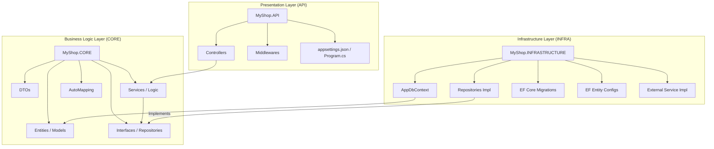

# MyShop Backend Architecture & File Structure

This document provides a comprehensive visual map of the backend project, following the Clean Architecture pattern with three main layers: **API**, **CORE**, and **INFRASTRUCTURE**.

## 🏗️ Visual Architecture Map

---

## 📂 Detailed File Structure

### 🌐 MyShop.API
*The entry point of the application, handling HTTP requests and routing.*
- 📁 **Controllers/**: REST Endpoints (Auth, Products, Cart, Orders, etc.)
- 📁 **Middlewares/**: Exception handling, Logging, Auth filters.
- 📄 **Program.cs**: Dependency Injection and Middleware pipeline configuration.
- 📄 **appsettings.json**: Configuration for Connection Strings, JWT, and SMTP.

### 🧠 MyShop.CORE
*The heart of the application, containing business rules and domain logic.*
- 📁 **Entities/**: Database models (Product, User, Order, Category).
- 📁 **Interfaces/**: Abstract definitions for Repositories and Services.
- 📁 **DTOs/**: Data Transfer Objects for clean request/response handling.
- 📁 **Services/**: Implementation of core business workflows.
- 📁 **AutoMapping/**: Profile configurations for mapping Entities to DTOs.
- 📁 **Consts/**: Global constants and enums (Roles, Categories).

### 🛠️ MyShop.INFRASTRUCTURE
*Handles data persistence and communication with external systems.*
- 📁 **Context/**: `AppDbContext` for Entity Framework Core.
- 📁 **Repositories/**: Concrete implementations of the CORE interfaces (UnitOfWork, CRUD).
- 📁 **Configs/**: Fluent API configurations for database schema (Relationships, Indexes).
- 📁 **Migrations/**: Version history of the database schema.
- 📁 **Services/**: Implementations for Token generation, Emailing, and File Storage.

---

## 🛠️ Technology Stack
- **Framework**: .NET 9.0
- **ORM**: Entity Framework Core
- **Database**: SQL Server
- **Auth**: JWT (JSON Web Tokens) & ASP.NET Identity
- **Mapping**: AutoMapper
- **Documentation**: Swagger/OpenAPI
